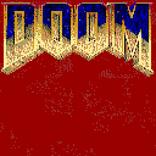

## Screen Melt

A quick code lab to explore the use of custom palettes in the [Pyxel game engine](https://github.com/kitao/pyxel).



## Install

This project uses [Poetry](https://python-poetry.org "At last Python has more or less caught up with modernity about dependency management"), so all you have to do is install Poetry and run `poetry install` in this project directory.

## Run

In order to completely isolate your environment, you should run this project under Poetry's managed environment:

Either in a separate shell spawned by Poetry:

```
poetry shell
python main.py
```

Or directly through the run command: `poetry run main.py`

